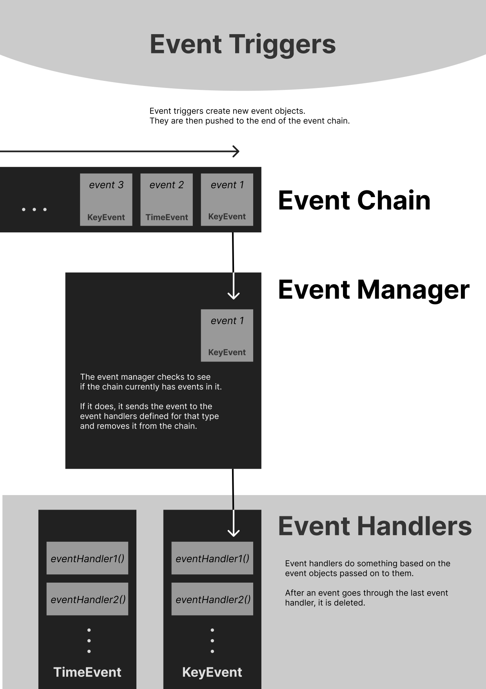

# Concepts Used in Implementing this Program

Alright, so after about an hour of pouring through the depths of the internet, I've decided to compile what I've found... although some of the resources I came across were pretty good, I think its best I collated them and their contents into one document (this file)... do note that some of the resources are linked below and you can click on them if you think any of my explanations are a bit lacking (I didn't check youtube though, and if you find some good videos there, that would be helpful too)... Anyway, here is a journey through some of the concepts our implementation uses; I've included some pertinent images to help visualize some things, although its preferable to check them out *after* each chapter.

## 1. Compiling a C Program

Before we begin, let's just have a short refresher on how a C program is compiled (a good overview [here](https://www.prepbytes.com/blog/c-programming/compilation-process-in-c/)). Whenever you do this to a C program, the compiler actually does a few things under the hood.

<p style="text-align:center;">
  
</p>

### 1.1 Preprocessing
The first thing it does is to check the file for **preprocessor directives** (more info [here](https://www.geeksforgeeks.org/cc-preprocessors/)). These are
basically any lines that begin with the `#` symbol. In the case of `#include`, the preprocessor replaces the line with the actual file we want to import. With `#define`, on the other hand, the preprocessor replaces instances of the name we defined with the code we associated with that name. So something like 

```C
#define AGE 69
```

means all instances of `AGE` will be replaced with `69` in our C file. Essentially, you can think of the preprocessor as just some guy who edits your original code. It just modifies what you have so that all lines with a `#` are replaced by whatever they're supposed represent. 

### 1.2 Compiling the C File to an Object File
After this is done, the compiler can then turn that modified C file into instructions your computer can understand. The resulting file containing these instructions is called an **object file**. But depending on whether or not your original C file imports other libraries, the compiler might have to combine more than one of these object files.

You see, whenever you have something like `#include <stdio.h>`, what you're actually including is a file containing just **function prototypes**. A function prototype is just a function declaration without the function body. So stuff like

```C
// A function that does something
void doSomething(int myNumber);

// A function that returns the age of a person
int returnAge(struct Person *person);
```

are function prototypes (they do not contain the code that the function actually executes). These are the only things appended to your original C file when the preprocessor replaces the `#include` line. 

So where are the actual function implementations? Where's the code we need to run the functions? That's where the linking process comes in. 

### 1.3 Linking the Object Files

Because turning a C file (especially larger ones) into an object file is a rather tedious process, most of the libraries we use (the standard library included) have already had their C files turned into object files before shipping them out for us to use. The header files we import are there just so we know how to use the functions that have been compiled; they don't actually have the code for those functions. The only thing the compiler needs to do would be to combine those object files together, and usually the compiler is smart enough to know which object files are associated with which header files. 

Every time you use a standard library using the `#include` directive, the compiler already knows which object files to link. So although header files are only supposed to contain function prototypes, the implementations of these functions (which, again, are already object files at this point) are linked to your program during this step.

You can also think of it this way: when we include header files, what we're basically doing is telling the compiler what functions we'll be using; additionally, the header file also tells us how to use those functions (through their prototypes). But the actual code needed to run those functions isn't provided to our program up until after the compilation process. After all, those files can be pretty big, and importing then compiling those functions *every time we need them* would be rather wasteful.

Technically speaking, there's a step before linking called **assembling**, but we don't need to know that here. Just know that after linking all the object files together, the C file has effectively been transformed into something that can run on your computer.

---
> **Chapter 1: Compiling a C Program**
> 
> ***How this Concept Relates to the Implementation***
>
> #### 1. Why are Our Header Files Chonky AF? 
> You might notice that most of our *custom* header files (you don't need to check this out but more nuances about them [here](https://gribblelab.org/teaching/CBootCamp/12_Compiling_linking_Makefile_header_files.html)) include more than just the function prototypes: they include the function implementations too. If header files are only supposed to tell us how to use a function, why are we doing this?
>
> Sadly, whenever we have our own custom header files, the compiler has some trouble figuring out which object files to link to our program. This means that when compiling, we may have to manually specify what files to link. This can make our compile command look nasty the more custom header files we have, and it would probably look like this:
>
> 
```Bash
gcc -o main main.c header1.c header2.c header3.c header4.c ...
```
>
>where the `header.c` files represent the function implementations of the `header.h` files we've included in `main.c`. To avoid annoying ourselves (and sir), we will be defining our function implementations with their prototypes on all our header files. This essentially means that the preprocessor combines all the code in our files into one big C(hungus) file, which then gets turned into a **single** object file (although the stuff we import from the standard library are probably still linked).
>
> #### 2. What are the `#ifndef` Stuff for?
>
> At the beginning of our custom header files, you might notice something like
>
```C
#ifndef HEADER_FILE_NAME_
#define HEADER_FILE_NAME_
```
> followed by one of these at the end of the file:
```C
#endif
```
> These are what we call **inclusion guards**. What this basically does is it encloses the entire code in our file within a massive if statement. Everything between the `#ifndef` and the `#endif` is included by the preprocessor *only when* `HEADER_FILE_NAME_` is not defined.
> 
> Why is this important? When we're coding with a lot of header files, it's really common for us to include the same header file in multiple places. Consider this example:
```C
/**
 * This is header1.h
 **/
#include "ourCommonHeader.h"

// Let's pretend we have some other code here
...
```

```C
/**
 * This is header2.h
 **/
#include "ourCommonHeader.h"

// This is another file
// But it also needs the common header file for its stuff
...
```
> Now let's say we import both of these files in `main.c`.
```C
#include "./header1.h"
#include "./header2.h"
```
> Oops! The preprocessor replaces both of these with their respective contents, and we end up with two `#include "ourCommonHeader.h"` in our big C(hungus) file! In other words, there's an impostor among us.
>
> Jokes aside, people realized this could be a problem so they created these things called inclusion guards. Basically, the first time we encounter `#include "ourCommonHeader.h"` above, it's replaced by all the code associated with `ourCommonHeader.h` **AND** it does a `#define` on its inclusion guard. Because of this, any of the succeeding times we encounter `#include "ourCommonHeader.h"`, the `#ifndef` on its inclusion guard will return false, and so the code of `"ourCommonHeader.h"` will never be copied more than once. If we didn't do this, the compiler would probably throw an error telling us its confused why the hell we have two definitions for the same function in our code.
>
> It's important to note that standard library headers implement these by default, and that the name of the inclusion guard usually ends in a `_` to prevent name conflicts with any actual constants we may have elsewhere from our `#define` directives.
>
> #### 3. What the heck is `#ifdef _WIN32` for?
>
> `_WIN32` is just something the C compiler defines (more nuance [here](https://stackoverflow.com/questions/662084/whats-the-difference-between-the-win32-and-win32-defines-in-c])) whenever we're compiling in a Windows environment. This is useful, because it allows us to check whether or not we're running on Windows or not Windows (usually Unix / Linux). Although the C language does its best to offer a **standard** that aims to make the language behave consistently across different systems, the reality is much more depressing. Especially because we're using **C99** (which is pretty old already; if you want everything covered by the standard, check [this](https://en.cppreference.com/w/c/99)), there are a lot of things *not* covered by the C99 standard, and so these "things" will behave differently on different platforms. We'll talk more about this in a later chapter.
>

## 2. Program Memory

Programs have a specific way of managing memory (you can read [this](https://gribblelab.org/teaching/CBootCamp/7_Memory_Stack_vs_Heap.html) after the chapter).

<p style="text-align:center;">
  
</p>

### 2.1 The Call Stack

In almost all programming languages, a **call stack** is implemented to help keep track of the **functions** (some say **sub/routines** or **procedures**) we're currently running. You can think of a function as a group of instructions we've packaged together inside a **context**, with all the variables and parameters they need to run.

So how exactly does a call stack work? Every time we call a function, we're essentially saying "hey, let's put ourselves inside the context of this function and just consider everything *it* has for now; we're not really concerned with anything else outside, we'll just finish everything we have inside first". Everything the function needs is allocated for it by the program and added on top of the call stack. Only the top of the call stack is accessible at any given time, which makes sense since the function of utmost priority (the one we called last) should be what the program should aim to finish first, before it can resume executing the other stuff underneath it.

Once the current function is done executing, the top of the call stack is "popped" and everything that was allocated for it is removed. We don't need those things anymore, and it's time to put ourselves back into the context of the previous function (if you want really specific details about how a stack works, check [this](https://en.wikipedia.org/wiki/Call_stack#Structure), although even I don't understand it to that depth).

This is a really convenient structure for managing the memory of a program. However, when we start to deal with more complicated data types like structs and objects, things get a little inefficient. 

As a simple example, let's say we wanted to create a function that returned a string with a few hundred characters. The function could work just as well returning the actual contents of the string, and the program would store the return value in a new variable. But as our objects get larger in size, this becomes very impractical as copying a few thousand bytes every time we want to move objects around is a very bad idea. Not only that, but if we return a pointer to an object *created within a function*, that pointer becomes useless as soon as the function exits because the original data stored at that location also gets popped off of the stack.

### 2.2 Heap Memory

Heap Memory (sometimes called Dynamic Memory) is a nifty solution to the previous dilemma. It allows us to allocate memory for objects outside of the call stack, where we won't have to worry about our objects disappearing after the function that created them exits. Passing around a pointer to the allocated memory can then make the program more efficient at handling data.

In C, there are only two functions that allow us to allocate memory in the heap: `malloc()` and `calloc()` (although there's also `realloc()` which can help us resize chunks of memory). Both of these functions return *a pointer* to the allocated memory. But because C is a baby, we have to tell it to deallocate the memory once we're done using it with `free()`. The `free()` function accepts a pointer to the memory we wish to deallocate. All these functions are available in the `<stdlib.h>` header.

As a sidenote, here's an important reminder of why `free()` exists. Let's say we do the following:

```C
char *charPointer = calloc(1, sizeof(char));        // Allocate memory for 1 character
char *charOtherPointer = calloc(1, sizeof(char));   // Allocate memory for another single character

*charPointer = 'a';
*charOtherPointer = 'b';
...
```

Currently, our pointers refer to different locations in memory. But if we do:
```C
charPointer = charOtherPointer;
```
Both of the pointers are pointing to the location of `'b'` now. What happened to the original character `'a'`? It's still in the heap memory! What the heck? But I don't have a pointer to it anymore? How am I going to get it back??

Well, you can't get it back. It's gone forever. You wasted memory. This is called a **memory leak**.

Whenever you allocate memory using `calloc()` or `malloc()` be sure to call `free()` before you lose track of the pointer. Otherwise, your progam will keep using up more memory which you won't be capable of freeing, at least not until you finally decide to terminate your program.

If some things are still a bit fuzzy, [here's a short thread](https://www.reddit.com/r/AskProgramming/comments/12kr0pp/comment/jg3l4ge/?utm_source=share&utm_medium=web3x&utm_name=web3xcss&utm_term=1&utm_content=share_button) I found with some neat insights into program memory.

### 2.3 Static Memory

This is a separate region for storing "global" variables. But because we won't be using these, we can safely pretend this guy doesn't exist.

For a summary of the three different types of memory, you can check [this](https://craftofcoding.wordpress.com/2015/12/07/memory-in-c-the-stack-the-heap-and-static/) out.

---
> **Chapter 2: Program Memory**
> 
> ***How this Concept Relates to the Implementation***
>
> #### 1. Why tf are there so Many `calloc()` Calls Everywhere?
> A lot of the structs we have in our program have four very specific functions associated with them. What we're actually trying to do is to emulate object-oriented programming... in C! C is such a pussy that it doesn't know what OOP is. Let's go through an example of how we try to do OOP in C (it's not true OOP because we don't have methods (aka functions) tied to the structs, but let's just pretend it is).
>
> Let's say we have the following struct definition for a "class" called Person
```C
typedef struct Person {
  int age;
  char name[32];
} Person;
```
> The first two functions help us (1) allocate memory for an instance of the struct in heap memory and (2) initialize the memory with the values we want it to have.
```C
Person *Person_new() {
  Person *pPerson = calloc(1, sizeof(*pPerson));
  return pPerson;
}

Person *Person_init(Person *this, int age, char name[]) {
  this->age = age;            // Copy the age
  strcpy(this->name, name);   // Assume that we have <string.h> up there

  return this;
}
```
> Note that we use the keyword `this` to refer to the instances we pass because this is usually the keyword used by OOP languages to refer to current the instance the function is acting on.
>
> Also, the `->` operator works just like a `.`, but for pointers. The two pieces of code are equivalent:
```C
// Assuming `this` is a *pointer* to an instance
this->member;

// is the same as
(*this).member;
```
> Although as you can see, the first is clearly superior because it uses two less characters!
> Now when we're actually working with our C "classes", we don't want to have to call `Person_new()` then `Person_init()` each time. It's best we merge these two processes under a single function. This brings us to
```C
Person *Person_create(int age, char name[]) {
  return Person_init(Person_new(), age, name);
}
```
> This makes our lives way easier and keeps things just a little cleaner. At this point, I caught myself asking "why don't we just put the code of the `Person_new()` and `Person_init()` functions inside the `Person_create()` function? That way we don't have to write the `_new()` and `_init()` stuff for each class." While this might sound like a good way to save me some time typing a few extra lines, I feel like it's still better separating out these two processes into their own functions anyway because it makes the code much more clear, and in the case that the `_init()` of an object does a lot of its own stuff, the `_create()` function does a good job of abstracting all that for us. We might also want to call `_new()` without calling `_init()`; this has happened before (though I don't recall where I needed to do that).
>
> The last important function is the `_kill()` function. 
```C
void Person_kill(Person *this) {
  free(this);
}
```
> All this actually does is to call `free()` on the provided pointer, effectively deallocating the memory of the instance. While we could just call `free()` instead of using the `_kill()` functions, some of our classes actually have other stuff to do inside their `_kill()` functions, so its best to use this rather than calling `free()` directly on an instance.
>
> #### 2. Beware of Hidden `malloc()` and `calloc()` Calls
> Just a quick warning before we move on to the next chapter: some standard library functions use `malloc()` and `calloc()`, and unless they say otherwise, it's important you call `free()` on these too. If you don't, baby C is gonna keep eating RAM... Johnny, Johnny! Yes papa? Eating RAM? You get the idea.
>
> How do you know if a function uses `calloc()` or `malloc()`? Fear not! The world wide web is full of documentation on basically everything, so you can easily know if a function uses one of these things.

## 3. Threads and Mutexes

<p style="text-align:center;">
  
</p>

When you run a C program, a single **thread** of execution is created wherein all the instructions you provide execute one after the other. If one process takes too long to finish, everything else the program has to do gets delayed. Unfortunately, once your program gets large enough, you can't avoid having to deal with one of these **blocking processes** that clogs up the whole line of execution. It's like those shared dormitory bathrooms in the morning: there's always that one mf who takes an hour in the shower.

### 3.1 Threads

So how do we deal with these processes? Thankfully, we have threads. Threads allow us to create another path of execution, so to speak, that can let our program do other things on the side while the main process goes on. Remember the stack and heap we talked about? Whenever we create a thread, we actually create a new call stack specifically for that thread. That way, it can execute its own sequence of functions without disturbing the main process. However, no new heap is created. All threads within the same program share the heap memory, which is a really powerful thing! This allows the threads to be able to talk to each other, and is another reason to use `calloc()` and `malloc()` in our program.

But what if two threads want to modify the same chunk of heap memory at the same time?

### 3.2 Mutexes

A mutual exclusion (more commonly known as a mutex) can help us prevent this from happening (I think the analogy [here](https://www.reddit.com/r/explainlikeimfive/comments/29prmj/eli5_in_computer_science_what_is_a_mutex/) is pretty nifty; and no, I didn't realize until after I saw this post that I used a similar analogy above LMAO). Think of a mutex as a lock that restricts access to a memory location. Whenever a thread wants to modify a piece of memory, it first has to ask the mutex associated with that memory whether or not it is currently locked. If it's free, the mutex locks itself for the requesting thread and gives it exclusive access to the resource. Otherwise, the thread is sad and either has to (1) wait for it to become available or (2) carry on doing something else instead.

### 3.3 Implementing Threads and Mutexes

<p style="text-align:center;">
  
</p>

Now you might notice that I haven't provided any code explaining how to implement threads and mutexes. That's because it's one of those things that the **C99** standard doesn't define. I was about to pull a big sad until I heard that **Windows** implements threads and mutexes. Not only that, but **Unix** (basically Linux systems) also support these things. In other words, even though C99 doesn't give us a direct way to create them, our operating systems do! 

How exactly do we access these functionalities though? Well, it depends on whether you're using Windows or Linux. For the sake of simplicity, I'll explain how to go about this on Windows.

When we're on Windows, the operating system (OS) actually provides us a way to access its features when we're building our own programs. These features are available to us in C when we include stuff like the `<windows.h>` header file, among other things. 

To use threads and mutexes, we include the following files:
```C
#include <windows.h>
#include <conio.h>
#include <process.h>
```
after which the following functions become available to us:
```C
CreateMutexA();         // Allows us to create a mutex for a memory resource
ReleaseMutex();         // Allows us to unlock a mutex

_beginthread();         // Allows us to start a thread
WaitForSingleObject();  // Allows us to wait for a thread to end OR
                        //    Wait for a mutex to become available OR
                        //    Something else entirely

...
```
I won't list all the functions here, but Microsoft provides some documentation about all the stuff available in `<windows.h>` and their other header files (I DONT'T recommend you check their docs though, they do a bad job of explaining stuff LMAO). If you have more questions about these, I can try my best to answer them for you.

The process of doing this in Linux systems is pretty much the same, although the name of the functions are different because the people who made Windows are not the people who made Linux. I'll get more into why this is a massive pain in the ass in a later chapter; for now just remember that although a C standard exists (which is supposed to make C the same for everyone), wanting to do things not covered by the standard means you will probably have to break your brain to try and make sure your program works the same for someone on Windows and someone who isn't.

---

> **Chapter 3: Threads and Mutexes**
> 
> ***How this Concept Relates to the Implementation***
>
> #### 1. `utils.thread.unix.h` and `utils.thread.win.h`?
> As I explained earlier, things not covered by the C standard are things we will have to implement ourselves. Windows and Unix-based systems (which include Linux and Mac) have their own different ways of implementing threads, and these are available to us when we include the proper header files provided by the OS (these are not really external libraries; usually external libraries are installed by the programmer for them to use in their projects, but these are readily available with the OS).
>
> On Windows we have `<windows.h>` to help us deal with threads. On Unix-based systems, it's `<pthreads.h>`. Fun fact, in C11, `<pthreads.h>` was actually adopted and became part of the C standard, so we wouldn't have had to do all these gymnastics if we were allowed to use a newer version of C.
>
> A recurring theme of using C (specifically C99) to build programs is that a lot of things aren't covered by the standard. That's what you get for using baby C I guess.
>
> #### 2. But Why Do We Need Threads in *Our* Program?
> I ask myself this as I lay awake in bed after having spent a week trying to implement threads for our program using nothing but the shtty documentation of the Windows and Unix operating systems... "AHAHA!" I say. jk. Threads are pretty cool because we get to do things like event handling (which I'll explain in the next chapter). Also, we can add animations (!!) and a neat timer (!!) to our program now :D I think it's rather funny because people usually employ threads to make their programs more efficient; in our case, we're using threads solely to add different kinds of functionality.
>
> #### 3. Why Did You Wrap the Thread and Mutex Functions in Your Own Class?
> You might notice that I created my own classes (the Thread and Mutex classes) which store references to actual thread and actual mutex objects provided by the OS. This is also true for the other functions we defined (for example, we have our own `Mutex_unlock()` which wraps around `ReleaseMutex()` in Windows and `pthread_mutex_unlock()` on Unix). Why did I have to wrap the OS objects and functions with my own stuff?
>
> The reason again has to do with the fact that Unix and Windows are not friends. Because using threads on the two operating systems forces us to use different functions, we want to (as much as possible) wrap our own classes around these functions and objects so that they end up having the same name, regardless of whether or not we're on Windows or Unix. That way, we don't have to worry about calling two different functions each time. Consider the code below:
>
```C
// You are in Windows
#ifdef _WIN32
#include "./win/utils.thread.win.h"

// Not in Windows
#else
#include "./unix/utils.thread.unix.h"
#endif
```
> As we saw in Chapter 1 `_WIN32` is just something your compiler defines when you're on Windows. This is neat, because we can import different files based on what OS we're on.
>
> Now because all the functions in `utils.thread.win.h` and `utils.thread.unix.h` have the same name (these are the functions / classes we used to wrap around the different stuff we used for Windows and Unix), we can call something like `Mutex_unlock()` (which ***we*** defined), and it won't matter whether or not `utils.thread.win.h` or `utils.thread.unix.h` was included because both files defined this function (although each with different stuff inside).

## 4. Callbacks

A **callback** is just a function that is passed as an input to another function. It usually gets called after being passed, (otherwise, what would it be for).

Like other more complicated data types, functions are usually passed as pointers. Remember how an array is kinda like a pointer? A function behaves similarly when its passed as an argument.

### 4.1 Typedefs for Callbacks (or Functions in General)

The "type" of a function looks rather verbose. When using functions as parameters to other functions, we can end up with something that looks like this:
```C
void parentFunction(char *(*callbackFunction)(int a, int b)) {
  printf("%s", callbackFunction(1, 2));
}
```
WTF is that sht? I don't want to have to write this monstrosity of a line `char *(*callbackFunction)(int a, int b)` every time I want a pointer to a function that returns a `string` from two `int` inputs. And what if midway during the coding process we suddenly decide our `callbackFunction` needs three `int` inputs, not two? We'll have to modify every single instance of that line just to implement that change.

Luckily, just like other data types, we can `typedef` our functions. It may look confusing at first, but it'll spare us headaches down the line. In general, the format goes as follows:

```C
typedef return_type (*function_type)(param_type1, param_type2, ...);
```

By doing `(*function_type)`, we're explicitly saying that `function_type` is a pointer to a function. After the `typedef`, we can finally do something like
```C
void parentFunction(function_type callbackFunction) {
  printf("%s", callbackFunction(1, 2));
}
```
It looks way cleaner, right? It's also better for us developers because we only have to change one line of code when we decide to change how the function behaves. For more information on typedefing function, check [this](https://stackoverflow.com/questions/4295432/typedef-function-pointer) out.

---

> **Chapter 4: Callbacks**
> 
> ***How this Concept Relates to the Implementation***
>
> #### 1. Why Do We Need Callbacks for Our Program?
>
> The next chapter actually has our answer to this question, but as a sneak peek, we need callbacks in order to be able to implement events. With events, we want something to happen after a certain trigger occurs. This "something" is usually given as a callback to an event (the trigger).

## 5. Events

Events refer to things that can happen while your main program is running. Usually, events are unpredictable and demand immediate attention; they need to be **handled** when they occur. But if our main thread is busy doing something else, it can't just stop what it's doing to deal with new events.

The solution is to have a separate thread dedicated to handling events. In this way, even if our main process isn't available for dealing with events, we can have another thread do that for us.

Additionally, to actually **listen** for events, we can't just tell the main thread to do that too. If it did, it wouldn't be able to do anything else because it would be waiting for events to occur just so it can take note of them. Thus, it makes sense to have another thread of execution dedicated to listening for events.

Other programming languages (like Java and Javascript) support events more or less natively. In C, we kind of have to do it ourselves. 

---

> **Chapter 5: Events**
> 
> ***How this Concept Relates to the Implementation***
>
> #### 1. How Exactly Do We Implement Events?
>
> There are different ways to go about handling events, although for our case I came up with a neat structure. I don't think I can explain it that well without having to illustrate it, so here's a neat little infographic I made to depict how we handle events in our program.
>
> 
>
> It is important to note that, as stated above, the event handlers have their own thread of execution. The event listeners (event triggers) also have their own separate thread. All in all, our program has three major threads: (1) the main thread, (2) the event listener thread, and (3) the event handler thread. I'll try to explain more about the nuances of this structure when we meet again.

## 6. Reducing Data Types: It's All Bits! 

All data types are basically just groups of bits we decided to interpret in certain way. For example, in an `int` data type a given sequence of bits just stores a decimal number in binary, while the same sequence of bits in a `char` data type would probably represent something else.

But if we're being really clever, we can completely ignore the actual data type we're dealing with and work directly with the bits stored by any variable. In this way, based on how we read these bits, it's almost as if we have our own custom data type--we interpret the sequences of bits in our own way.

### 6.1 Bitwise Operators

The C language provides us with operators to directly manipulate the bits of a piece of data. Let's pretend we have the following declaration:
```C
// An char has 1 byte
// So in total it has 8 bits
char bits = 1;                // 0000 0001
char bits2 = 15;              // 0000 1111
char bits3 = 0;               // 0000 0000
char bits4 = 30;              // 0001 1110

// This is also valid and is equal to bits4
char bits5 = 0b00011110; 

```
Given the code above, we currently have three variables, each with 8 bits. If we want to do stuff with those bits, we can use the following operators:
```C
char result;

// (1) The & operator
// It checks each pair of bits between the two variables
// For each pair, it produces 1 if both are true (the AND of the two bits)

result = bits2 & bits4;         // 0000 1110


// (2) The | operator
// Produces the OR of each pair of bits

result = bits2 | bits4;         // 0001 1111


// (3) The ^ operator
// Produces the XOR of each pair of bits

result = bits2 ^ bits4;         // 0001 0001


// (4) The ~ operator
// Flips all the bits in a variable

result = ~bits4;                // 1110 0001


// (5) The >> operator
// Shifts all the bits to the right by the specified amount
// Bits that go past the rightmost position basically disappear

result = bits4 >> 4;            // 0000 0001


// (6) The << operator
// Shifts all the bits to the left by the specified amount
// Again, bits that "fall off the left edge" are discarded

result = bits4 << 4;            // 1110 0000

```

None of these bitwise operations modify the original variable. You have to store the result elsewhere (or use it in an expression) if you want the operation to be meaningful.

### 6.2 Differences with `&&` and `||`

The differences of our bitwise operators with the traditional operators `&&` and `||` are actually quite simple: whereas `&&` and `||` interpret the variables based on their data type, `&` and `|` perform actions on variables *one bit at a time*; in other words, `&&` and `||` consider all the bits as a whole while `&` and `|` consider them individually. The same is true for `!` and `~`.

### 6.3 Valid Data Types to Use For Bit Manipulation

Now although all data types are essentially just sequences of bits, the operators C gives us to manipulate bits are not applicable to certain data types. Only **int-based data types** are allowed to be manipulated with these  (the other class of types, which are **float-based data types**, cannot be subjected to bit manipulations because of the way they store their bits). The available int-based types are:
```C
char;           // 1 byte

short;          // 2 bytes
unsigned short;

int;            // 4 bytes
unsigned int;

long;           // 8 bytes
unsigned long;
```

There are some other stuff out there like `signed char`, but they're honestly quite pointless to consider. The main data types listed above are the most important ones we'll be looking at.

Whenever we say something is `unsigned`, it just means we won't be storing negative values there. In other words, we won't interpret the bits as a 2's complement encoding (CCICOMP coming back fr), but rather as a standard binary representation. This is important because if we want to do arithmetic with our bits (like adding them), there might be a difference between `unsigned` and `signed` types (or maybe I'm just tripping).

You might also see that we actually have quite a selection of different possible data type sizes to choose from. We have characters with 1 byte and long integers with 8. This is really cool and it allows us to be more precise with the variables we're making.

### 6.4 Fixed-width Data Types

When we're actually using these data types in our program, it feels kinda weird using `char` when all we want is just an 8-bit variable. To fix this, other people have decided to abstract the data types we listed above with different names. When we include the `<inttypes.h>` library, we're provided with the following types:

```C
uint8_t;    // An unsigned int of width 8 bits
uint16_t;   // An unsigned int of width 16 bits
uint32_t;   // An unsigned int of width 32 bits
uint64_t;   // An unsigned int of width 64 bits
```

Again, the data types have to be instances of `unsigned int` in order to behave properly when doing arithmetic. Actually, there's also another reason we'd rather use these data types instead of typing `char` or `long`.

Across different systems, certain data types may *vary in width*. The `int` data type, for example, might actually have just 2 bytes on other systems (usually, this happens on older computers). We don't usually have to worry about these, but why worry when you can use **fixed-width** data types instead? These make it so that when you say something like `uint32_t`, you're sure that it will always have 32 bits (or 4 bytes).

---

> **Chapter 6: Reducing Data Types: It's All Bits!**
> 
> ***How this Concept Relates to the Implementation***
>
> #### 1. Where Exactly Did We Use Fixed-width Data Types?
>
> Whenever we want to store a state that's either just on or off (a 1 or a 0), it's best to use a single bit to represent that state. Not that we'd actually get an amazing performance boost by using a single bit instead of 32 for a boolean, but if we consider a `uint64_t` as if it were an array of bits, that's where bit manipulation becomes powerful for us.
>
> Since we're doing minesweeper, we're definitely going to have a 2d grid containing stuff inside. Wouldn't it be cool if that 2d grid was just a 1d grid with a bunch of `uint64_t` inside? That way, it's like we have a 2d array of bits! 
>
> In our case, we'd probably have two of these grids during each game: one for storing bombs, and another for storing the flags placed by a user. And to implement something that can count the bombs around each cell, its as easy as adding all the bits around that cell! If we wanna check whether or not the flags placed by a user appear on top of the bombs, we can just check if the ^ (XOR) of each row of bits evaluate to 0. In short, this makes our lives easier, and it also makes our code way lighter.

## 7. Miscellaneous Ideas

### 7.1 Why We Use a Buffer Class

Whenever we print stuff using `printf()`, there's a bit of a delay incurred by the function. Usually we're all fine with using `printf()` per line of text we want to output, but imagine calling `printf()` *per character* we want to print. This would be extremely slow. On the opposite end, imagine calling `printf()` just once to print everything right away. We wouldn't see the screen take a while printing everything in sequence. That would be extremely fast.

To be able to pull of the second idea (calling `printf()` once), we have to have a way to create the output before rendering it to the screen. This is what the buffer class is for: all it does is it provides us with a tool with which to craft our output before we finally put it to the screen.

### 7.2 What are ANSI Escape Sequences

ANSI Escape Sequences (or more commonly, Escape Codes) are just sequences of characters that tell consoles and terminals to change their behaviour. They can let us change the color of our outputs, or place the cursor some place else.

This [documentation on github](https://gist.github.com/fnky/458719343aabd01cfb17a3a4f7296797) actually provides a comprehensive overview of the escape codes available to programmers like us.

Now another thing to note is that the Windows console may sometimes have a hard time knowing whether or not the characters we're printing to the screen are ASCII, UNICODE, or something else. This means that there are times when the Windows console can misinterpret our ANSI sequences. To fix this, the Windows OS actually provides us with a function that can help us configure the console. Inside the `win/utils.io.win.h` file, we have this line:
```C
SetConsoleMode(
  GetStdHandle(STD_OUTPUT_HANDLE), 
  ENABLE_PROCESSED_OUTPUT | ENABLE_VIRTUAL_TERMINAL_PROCESSING
);
```
The console mode is actually just an array of bits, with each bit storing whether or not a certain parameter is enabled. `SetConsoleMode()` allows us to specify which of those bits to turn on or turn off. The first parameter just tells us that we're modifying the console mode of the output device (the console we see); the second parameter tells the function which bits to turn on or off. `ENABLE_PROCESSED_OUTPUT` and `ENABLE_VIRTUAL_TERMINAL_PROCESSING` are just constants with one of their bits set to 1. By passing the `|` of the two of them, we're telling `SetConsoleMode()` that we want the bits at those locations to be equal to 1.

### 7.3 The Problem with C: Compatibility

<p style="text-align:center;">
  
</p>

The C standard isn't actually all that bad. It's just that we're using an older version of C (C99) that hasn't adapted to a lot of the changes in technology we've seen in the last 25 years. Because of this, we have to rely on the things people created to fill the gaps of the C standard (the gaps before the more modern versions of C came out). Thankfully, our operating systems provide solutions to these problems.

However, operating systems vary considerably. While there's a whole rich history behind Windows and Unix (Unix actually came first, by a long shot! Although Linux came about some five years after Windows), it's not worth it going through that here. Just know that both technologies took very different paths and subsequently have very different solutions to similar problems. This is rather painful, because programmers constantly have to account for these differences when working cross-platform. Windows wants to use its own standards; Linux wants to use its own standards; and Apple wants to look like it knows what tf it's doing with its standards but actually doesn't (jk these days they sometimes do).

### 8. Regarding Our Implementation

There are actually some more things I want to explain to you regarding our implementation, but these things relate more to how our program is designed rather than actual CS concepts... I'd personally prefer to explain these in person, and I'll try to do that within the week after our midterms LMOO. Anyhow, thank you for listening to my TED Talk. If you have any questions, fear not! I will try to answer them :D

